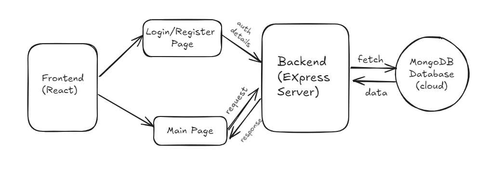

# WareHouse-Management
Inter IIT Tech Meet 13.0 development Team Selection Task

## Project Overview
The **Warehouse Management System (WMS)** is a full-stack web application designed to streamline warehouse operations, allowing users to manage inventory with ease. The system helps monitor stock levels, categories, brands, and the current status of items (whether they are in stock or out of stock).

### Key Features:
- **User Registration & Authentication**: Secure sign-up and login system.
- **Item Details**: View detailed information of items, including attributes such as price, quantity, and status.


## How It Works
It uses a 3-tier architecture:
1. **Frontend**: Built with React.js to provide a clean, intuitive UI for user interaction. Users can view and manage their inventory via a responsive interface.
   
2. **Backend**: Developed using Node.js and Express, the backend provides API endpoints for user authentication and inventory management.

3. **Database**: MongoDB is used for storing user and inventory data, offering a scalable NoSQL solution.

### Flowchart
 
*(Insert the system architecture flowchart here)*

---

## Prerequisites
Before starting, ensure the following tools are installed:
- **Node.js** (v14 or later)
- **MongoDB**
- A modern web browser (Chrome, Firefox, etc.)

## Setup and Installation

### 1. Clone the repository:
```bash
git clone https://github.com/yourusername/warehouse-management-system.git
cd warehouse-management-system
```
### 2.Install Dependencies
-frontend
```bash
cd client
npm install
```

-backend
```bash
cd server
npm install
```

### 3. MongoDB setup
Make sure you have MongoDB running locally or set up a MongoDB Atlas cluster. Update the MongoDB connection string in the backend .env file:

```bash
MONGO_URL=mongodb://localhost:27017/warehouse
```

### 4.Run the Development Servers

- backend(express server)
```bash
cd server
npm install
npm start
```

- frontend(React client)
```bash
cd client
npm install
npm run dev
```

### 5. Replace Url
replace the url in the frontend section:
```bash
src/components/sidebar.jsx
src/components/Login.jsx
src/components/SignupForm.jsx
```
find the url which is being fetched in these files and replace uptill the **.com** part with:
```bash
http://localhost:3000/
```